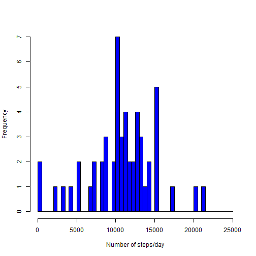
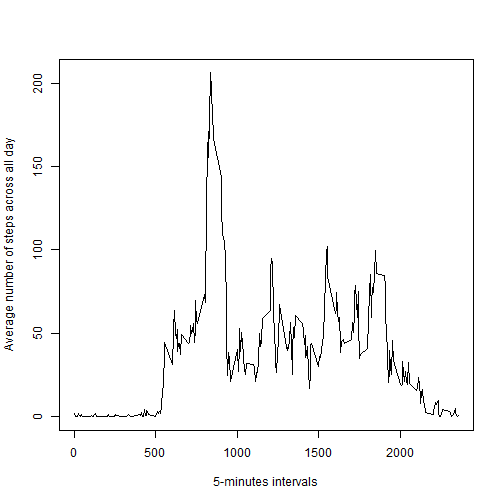
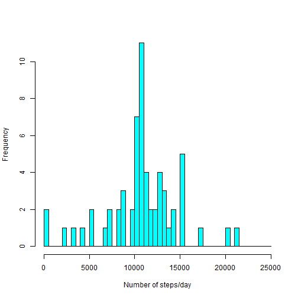
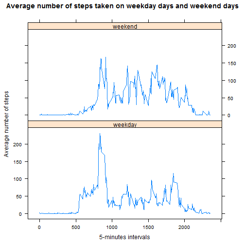

# Reproducible Research: Peer Assessment 1


## Loading and preprocessing the data
1. Load the data (i.e. read.csv())


```r
    unzip("activity.zip")

    df_activity <- read.csv("activity.csv")
```
2. Process/transform the data (if necessary) into a format suitable for your analysis

```r
    # removing NAs in the dataset
    df_without_na = na.omit(df_activity)
    
    # removing the names of rows (optional)
    rownames(df_without_na)=c()
```

## What is mean total number of steps taken per day?
1. Make a histogram of the total number of steps taken each day

```r
    # sum steps/day
    df_steps_day = aggregate(steps ~ date, df_without_na, sum)
  
    # Plotting the histogram of steps/day
    hist(df_steps_day$steps, breaks=seq(0,25000,by=500), col="blue", xlab="Number of steps/day", main="")
```

 

2. Calculate and report the *mean* and *median* total number of steps taken per day

```r
    mean(df_steps_day$steps)
```

```
## [1] 10766
```

```r
    median(df_steps_day$steps)
```

```
## [1] 10765
```

## What is the average daily activity pattern?
1. Make a time series plot (i.e. type = "l") of the 5-minute interval (x-axis) and the average number of steps taken, averaged across all days (y-axis

```r
    # Aggregation of number of steps in term of interval to have the mean
    df_meansteps_int <- aggregate(steps ~ interval, df_without_na, mean)

    # plotting the time serie
    xlabel = "5-minutes intervals"
    ylabel = "Average number of steps across all day"

    plot(df_meansteps_int$interval,df_meansteps_int$steps, type="l", xlab=xlabel, ylab= ylabel)
```

 

2. Which 5-minute interval, on average across all the days in the dataset, contains the maximum number of steps?

```r
    # Extraction of the line containing the max step
    subset(df_meansteps_int, steps==max(df_meansteps_int$steps))
```

```
##     interval steps
## 104      835 206.2
```

## Imputing missing values
1. Calculate and report the total number of missing values in the dataset (i.e. the total number of rows with NAs)


```r
    nrow(subset(df_activity, is.na(steps)))
```

```
## [1] 2304
```

2-3. Devise a strategy for filling in all of the missing values in the dataset. The strategy does not need to be sophisticated. For example, you could use the mean/median for that day, or the mean for that 5-minute interval, etc.


```r
    # Join the main dataset with the one has the mean for each interval 
    # to get a mean for each line in the main dataset
    mdata <- merge(df_activity, df_meansteps_int, by.x="interval", by.y="interval")

    # Rename the columns to have suitable names
    colnames(mdata)<- c("interval","steps","date","means")

    # Assign values to NAs steps in the dataset
    mdata$steps[is.na(mdata$steps)] <- subset(mdata,is.na(mdata$steps))$means
```

4. Make a histogram of the total number of steps taken each day and Calculate and report the mean and median total number of steps taken per day. 

```r
    mdata_steps_day = aggregate(steps ~ date, mdata, sum)
    hist(mdata_steps_day$steps, breaks=seq(0,25000,by=500.0), col="cyan", xlab="Number of steps/day", main="")
```

 

```r
    # Compute the mean
    mean(mdata_steps_day$steps)
```

```
## [1] 10766
```

```r
    # Compute the median
    median(mdata_steps_day$steps)
```

```
## [1] 10766
```
- Do these values differ from the estimates from the first part of the assignment? 

   Answer : *The value are almost the same*. 
   *The mean remains the same as in part-1 (10766), the median has moved by 1 unit from 10765 to 10766*

- What is the impact of imputing missing data on the estimates of the total daily number of steps?

  Answer : *There is not perceptible impact on the overall tendance.*

## Are there differences in activity patterns between weekdays and weekends?
1. Create a new factor variable in the dataset with two levels - "weekday" and "weekend" indicating whether a given date is a weekday or weekend day.

```r
    mdata$typeofday <- weekdays(as.Date(mdata$date))

    mdata$typeofday  <- ifelse(mdata$typeofday %in% c("Sunday","Saturday"),"weekend","weekday") 
```

2. Make a panel plot containing a time series plot (i.e. type = "l") of the 5-minute interval (x-axis) and the average number of steps taken, averaged across all weekday days or weekend days (y-axis)


```r
    library(lattice)

    mdata_meansteps_day = aggregate(steps ~ interval +typeofday, mdata, mean)
    
    ylabel = "Average number of steps"

    mainLabel = "Average number of steps taken on weekday days and weekend days"
  
    xyplot(mdata_meansteps_day$steps ~ mdata_meansteps_day$interval|mdata_meansteps_day$typeofday, mdata_meansteps_day, layout=c(1,2), type="l", xlab= xlabel, ylab= ylabel, main= mainLabel)
```

 

